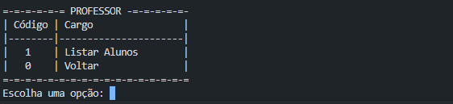

# Projeto Node.js Softex (UFPE) - Gestão Acadêmica 

<h2>Configuração preliminares</h2>

1. npm install sqlite3 (Instalação da biblioteca do BD)
2. npm install prompt-sync (Instalação da biblioteca do prompt)
3. node .\database.js (Criação do DB db.sqlite3 caso não exista)
4. node .\app.js (Execução da aplicação)

## Aruiteturta do Projeto

projeto/<br/>
├── database/<br/>
│   ├── alunos.js         # Funções DB de alunos<br/>
│   ├── professores.js    # Funções DB de professores<br/>
│   └── administrativo.js # Funções DB de administrativo<br/>
|── services/<br/>
│   ├── alunos.js         # Funções Objeto de alunos<br/>
│   ├── professores.js    # Funções Objeto de professores<br/>
│   └── administrativo.js # Funções Objeto de administrativo<br/>
├── app.js<br/>
└── package.json<br/>

## Excutar projeto por ícone na Área de Trabalho

1. Criar um arquivo TXT na área de trabalho e renomear para programa.bat
2. Incluindo o código abaixo dentro do programa.bat:

    ```
    @echo off
    chcp 65001 > nul
    title Sistema de Gestão Acadêmica
    cd /d "C:\PROJETOS\meu_projeto"
    echo Iniciando o sistema...
    node app.js
    pause
    ```

3. Ajustar o caminho ao qual o projeto foi salvo no seu desktop.
4. Executar pressionando duas vezes

## Telas dos Sistema de Gestão Acadêmica

1. Menu principal


2. Menu de Gestão do Administrato


3. Exemplo do menu CRUD


4. Exemplo de busca do professor e aluno


5. Exemplo de exlusão de objeto por ID


## Requisitos do Sistema

1. Objetivo do Sistema
    O Sistema de Gestão Acadêmica tem como objetivo principal gerir o setor administrativo e acadêmico da instituição, implementar controle de acesso e cadastros relacionados ao setor administrativo, alunos e professores. Ao passo que o protótipo, entregará módulos gradativamente ao longo do desenvolvimento.


2. Escopo
* Incluído:
    Gestão administrativa, docentes, discentes com informações detalhadas.
    Relatórios relacionados aos atores cadastrados
    Integração com banco de dados
    Não incluído:
    Acesso via front-end

3. Atores/Usuários do Sistema
* Administrativo:
    Realiza o cadastro de professores e alunos.
    Gerar relatório de professores e alunos cadastrados
    Realiza gestão dos atores: edição, remoção e inclusão.

* Professor:
    Consulta o aluno 
* Aluno:
    Consulta o professor

4. Requisitos Funcionais (RF)
    RF01: O sistema deve permitir o cadastro de funcionário do setor administrativo, professores e alunos com dados como: nome, telefone e e-mail.
    RF02: O sistema deve permitir ao funcionário do setor administrativo consultar, editar ou excluir informações relacionadas aos cadastros anteriores.
    RF03: O sistema deve permitir ao professor consultar qual aluno está matriculado na sua turma.
    RF04: O sistema deve permitir ao aluno consultar qual professor leciona na sua turma.
    RF05: O sistema deve permitir a geração de relatórios de consultas sobre os funcionários, professores e alunos.

5. Requisitos Não Funcionais (RNF)
    RNF01: O sistema deve estar disponível 24 horas por dia, 7 dias por semana.
    RNF02: O sistema deve ser responsivo e acessível apenas através de computador.
    RNF03: O sistema deve garantir a segurança das informações dos funcionários, professores e alunos em conformidade com a LGPD.
    RNF04: As operações de cadastro, edição e exclusão devem ser assíncronas (uso de async/await).
    RNF05: O sistema deve ser desenvolvido em JavaScript com Node.js

6. Regras de Negócio (RN)
    RN01: Apenas a equipe administrativa poderá cadastrar, editar ou excluir dados de professores, alunos ou de funcionários do setor administrativo.

## Responsávei pelo projeto (Turma Node.js Backend Softex - UFPE)

* Ericson Nascimento
* Alberto Pereira
* Niedja Brasil.


